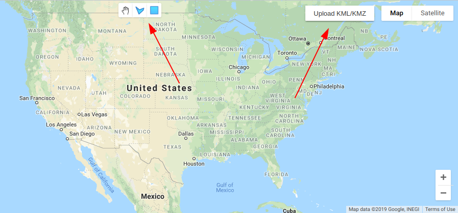
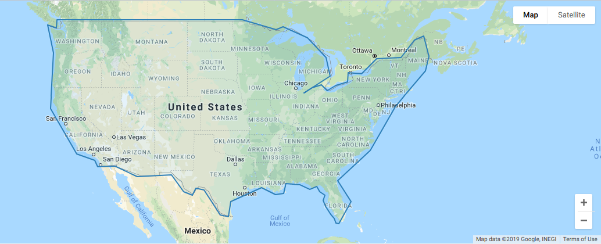
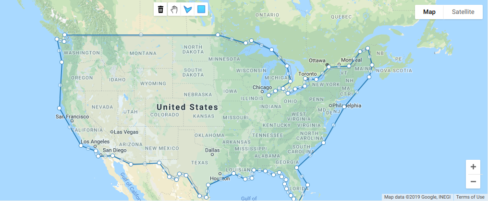
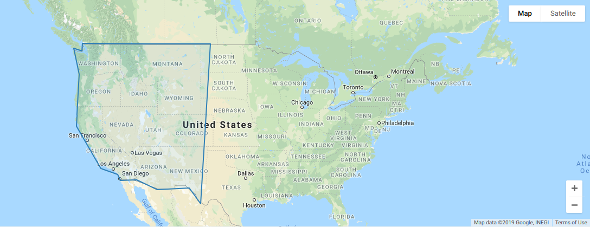

Map Widget API
**************

The following sections show you how to include the mapping widget and its functionality.

==============
Drawing Widget
==============

``showDrawingWidget()``

*Shows the drawing tools and upload file tool on the map.*

==============
Show Geography
==============

``showGeographyMap(id, isEditable, showHierarchy)``

*Shows a geography on the map.*

**Parameters:** 

* **id** (required): id of the geography to be shown
* **isEditable** (default is false): boolean flag to determine whether the geography shown should be editable
* **showHierarchy** (default is false): boolean flag to determine whether to include view hierarchy functionality

==================
Editable Geography
==================

If ``isEditable`` is to true, you can reposition each vertices to adjust the boundaries of the geography.

=======================
Hierarchy Functionality 
=======================

If ``showHierarchy`` is set to true, double left click on a geography to view child geographies and double right click to view parent geography 

